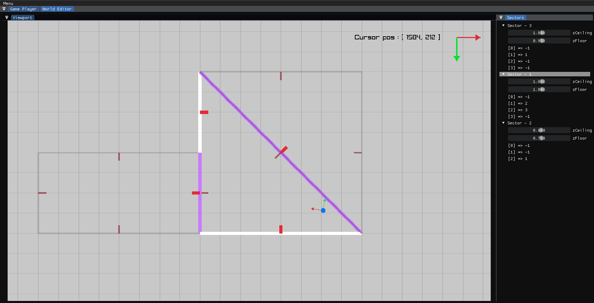

# Raycasting Engine - A Modern C++ Implementation of a DOOM Style Renderer

Welcome to the Raycasting Engine project, an implementation of a DOOM Style renderer using modern C++ and technologies like raylib and imgui.

This project is developed in a **recreational programming** context, it does not aim to be *production ready* at some point. It serves as a learning experience to explore new concepts and technologies while creating a project around them.

## Goals
The primary goal of this project is to implement a DOOM Style Renderer with a simple Engine around it and a Graphical Editor for prototyping Maps, rendering, gameplay etc... I'm using modern C++ and technologies like raylib and imgui it achieve this goal. At the end the engine should be able to build and ship a standalone executable without prototyping tools.

## Showcase




## Features checklist

For now the project in a prototyping phase, still mainly focused in making an efficient Renderer.

*Renderer*
- [x] DOOM Style rendering
  - [x] Sectors and top/bottom Elevation
  - [x] Neighbouring sectors sides
  - [ ] Textures for Wall & Borders
- [x] Pitch and Yaw for camera movement
- [ ] Vignette for sprites rendered on over walls
- [ ] Entities sprites within the 3D space
- [ ] Basic Physics including : 
  - [x] Elevation related to sectors 
  - [ ] Simple gravity
  - [ ] 3D space Raycast
- [x] Simple shading using far plane distance
- [ ] Dynamic lighting for light sources

*Editor*
- [x] 3D View
- [x] Simple inspector for Global world objects (Physics, Camera, etc...)
- [ ] Rendering Debugger
  - [ ] Step by step rendering
  - [ ] Rendering steps visalizer
 - [ ] Map Editor
  - [~] Sector Editor
  - [ ] Vignet editor
  - [ ] Sprite editor
 - [ ] Texture Browser

*System*
- [ ] Project instance cration : being able to create a project witch is using the engine and editor in one click
- [ ] Project shiping
  - [ ] Release Build
  - [ ] Assets bundle

## Building the project from sources

This repo toolchain as been created using my [cmake and vcpkg template](https://github.com/P0ulpy/cmake-vcpkg-template).

### Bootstrap workspace

`Windows :`

Make sure you installed [Visual Studio](https://visualstudio.microsoft.com/)

`GNU/Linux (apt) :`

Install necessary build tools and a C/C++ compiler
```sh
sudo apt-get update
sudo apt-get install build-essential tar curl zip unzip autoconf libtool g++ gcc
```

Then run the bootstrap script
```sh
# Unix
./scripts/bootstrap-workspace.sh
# Windows
.\scripts\bootstrap-workspace.bat
```

*Generate the project :*

```sh
# For debug build
# Unix
./scripts/generate-cmake-debug.sh
# Windows
.\scripts\generate-cmake-debug.bat

# For release build
# Unix
./scripts/generate-cmake-release.sh
# Windows
.\scripts\generate-cmake-release.bat
```

*Compile the project :*

```bash
# For debug build
# Unix
./scripts/build-debug.sh
# Windows
.\scripts\build-debug.bat

# For release build
# Unix
./scripts/build-release.sh
# Windows
.\scripts\build-release.bat
```

**Run the program**
You can now run the compiled program by looking into `out/Debug` or `out/Release`.
The out directory hierarchy will be different depending on your generator.

For exemple with Make generator in Debug mode run your program like that
```bash
# Unix
./out/Debug/raycasting-engine
# Windows
.\out\Debug\raycasting-engine.exe
```

## Licence

This repo is ender MIT Licence, see [LICENSE](LICENSE).
